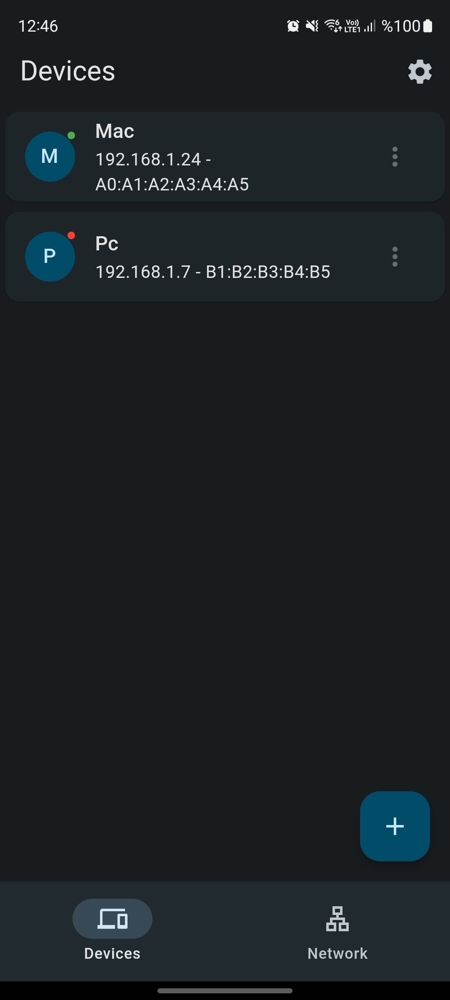

# Wake On Lan

Simple Magic Packet Sender

## Screenshots

<table>
  <tr>
    <td>Devices</td>
     <td>Network</td>
     <td>Settings</td>
  </tr>
  <tr>
    <td></td>
    <td></td>
    <td></td>
  </tr>
 </table>
